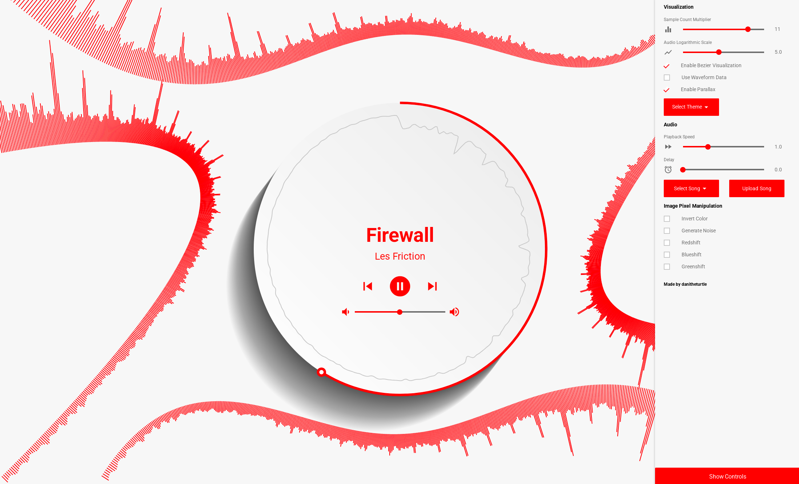

# JavaScript Audio Visualizer
### This is an archived project, no git history

An audio visualizer with zero external dependencies I made as an exploration of the JavaScript audio APIs.
This project was completed in 2017.

### Showcase

Or just play with it yourself here (note - gh pages doesn't like autoplay. seek around in the song or skip to the next track): https://danitheturtle.github.io/audio-visualizer-js/

# Credits
I do not own the rights to the included songs, they are simply included for example purposes. You can use your own songs, too!
Music:
* Dark Matter by Les Friction
* Firewall by Les Friction
* No Vacancy by OneRepublic
* Devastation and Reform by Relient K